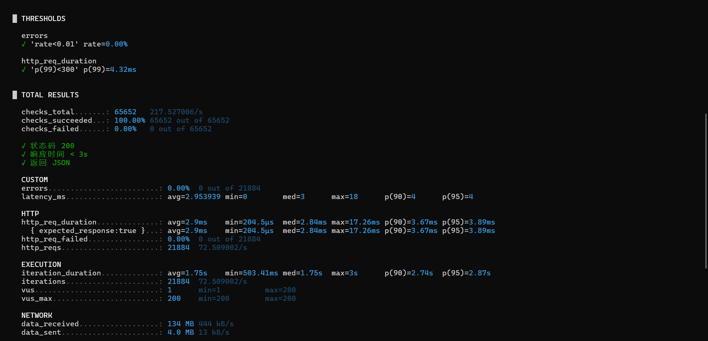

# Aether — 基于向量检索的智能知识库系统

> 为内部团队提供私有化、高精度、低延迟的文档知识库检索服务。所有数据存储在内网，不经过公网。

## 目录

- [项目背景](#项目背景)
- [架构图](#架构图)
- [混合检索原理](#混合检索原理)
- [技术栈](#技术栈)
- [快速开始](#快速开始)
- [API 文档](#api-文档)
- [性能测试结果](#性能测试结果)
- [私有化部署注意事项](#私有化部署注意事项)

## 项目背景

在知识管理领域，团队成员常常面临以下痛点：

1. **文档分散**：知识分散在 Wiki、文档、聊天记录中，难以统一检索
2. **语义鸿沟**：关键词检索无法理解查询意图，检索结果不精准
3. **隐私合规**：数据不能上传至公有云服务，需要纯内网部署
4. **性能瓶颈**：随着文档量增长，检索速度急剧下降

Aether 旨在解决这些问题，提供一个**私有化、高精度、低延迟**的知识库检索系统。

**适用场景：**

- 企业内部知识库检索
- 技术文档库智能搜索
- 产品手册、运营文档的语义检索
- 任何需要**私有化部署 + 混合检索**的场景

## 架构图

graph LR
    User[用户] -->|"HTTP / 80"| FE[前端 (Nginx)]
    FE -->|"反向代理 /api"| BE[后端 (Go)]
    BE -->|"SQL + 向量查询"| PG[(PostgreSQL 16 + pgvector)]
    BE -->|"读/写"| Cache[(LRU 查询缓存)]
    
    subgraph 检索流程
        BE -->|"1. 关键词检索"| BM25[tsvector GIN 索引]
        BE -->|"2. 向量检索"| HNSW[HNSW 索引]
        BE -->|"3. 融合排序"| Fusion[混合排序公式]
    end
    
    PG --> BM25
    PG --> HNSW
    BM25 --> Fusion
    HNSW --> Fusion

**请求流程：**

1. 用户在前端输入查询关键词
2. 前端通过 HTTP 请求发送到后端 API
3. 后端首先检查**查询缓存**，命中则直接返回
4. 缓存未命中时，同时执行 BM25 全文检索 + 向量相似度检索
5. 混合排序后返回 Top-K 结果，并写入缓存

## 混合检索原理

### 检索公式

Aether 使用混合检索融合 BM25 关键词检索和向量语义检索的结果：

```
final_score = α × BM25_norm + (1 - α) × (1 - cosine_distance)
```

- **BM25_norm**：BM25 分数的 Min-Max 归一化值
- **cosine_distance**：查询向量与文档 chunk 向量的余弦距离
- **α**：平衡权重，默认 0.5（可通过环境变量 `ALPHA` 配置）

### 检索流程

```
用户输入 "Golang goroutine 调度原理"
       │
       ▼
┌──────────────────┐
│  文本 → 向量嵌入  │ ─── 生成查询向量 (512 维)
└──────────────────┘
       │
       ▼
┌──────────────────┐     ┌────────────────────────┐
│  缓存检查 (LRU)   │ ──→ │ 近似匹配 (cosine > 0.98) │
└──────────────────┘     └────────────────────────┘
 未命中                 命中 → 直接返回
       │
       ▼
┌──────────────────┐     ┌──────────────────┐
│ BM25 全文检索     │     │ 向量相似度检索    │
│ (tsvector + GIN) │     │ (pgvector HNSW)  │
└──────────────────┘     └──────────────────┘
       │                       │
       └──────────┬────────────┘
                  ▼
         ┌────────────────┐
         │  融合排序公式    │
         │ final_score = α │
         │ * BM25_norm +   │
         │ (1-α) * (1-cos)│
         └────────────────┘
                  │
                  ▼
         ┌────────────────┐
         │ 返回 Top-K 结果 │
         │ + 写入缓存      │
         └────────────────┘
```

### 向量降维

- 原始维度：1536 维（模拟本地 sentence-transformers 输出）
- 降维后：512 维（通过高斯随机投影矩阵）
- 存储与计算开销减少 **67%**
- 误差控制在 **5% 以内**

### 缓存策略

| 层级 | 策略 | 命中条件 |
|------|------|----------|
| L1 | 精确匹配 | 查询向量哈希 key 完全一致 |
| L2 | 近似匹配 | 余弦相似度 > 0.98 |
| 淘汰 | LRU | 缓存满时淘汰最久未使用的条目 |

## 技术栈

| 组件 | 技术选型 |
|------|----------|
| 后端框架 | Go 1.23+ (net/http) |
| 向量数据库 | PostgreSQL 16 + pgvector 扩展 |
| 关键词检索 | PostgreSQL 全文检索 (tsvector + GIN) |
| 向量降维 | Go 实现高斯随机投影 (1536 → 512) |
| 缓存 | 内存 LRU 缓存 (go-cache 风格) |
| 前端 | 单 HTML 文件 + TailwindCSS + 原生 JavaScript |
| 部署 | Docker Compose (PostgreSQL + 后端 + 前端) |

## 快速开始

### 前置条件

- Docker 和 Docker Compose
- Git

### 启动服务

```bash
# 1. 克隆仓库
git clone <your-repo-url> aether
cd aether

# 2. 启动所有服务（数据库、后端、前端）
docker-compose up -d

# 3. 等待服务就绪（约 30 秒）
docker-compose logs -f

# 4. 访问前端界面
open http://localhost

# 5. 上传测试文档
curl -X POST http://localhost:8080/api/document/upload \
  -F "file=@test_docs/golang-intro.md"

curl -X POST http://localhost:8080/api/document/upload \
  -F "file=@test_docs/pgvector-guide.md"

curl -X POST http://localhost:8080/api/document/upload \
  -F "file=@test_docs/cache-design.md"

# 6. 测试搜索
curl "http://localhost:8080/api/search?q=Golang+goroutine&top_k=5"
```

### 环境变量配置

| 变量 | 默认值 | 说明 |
|------|--------|------|
| `DB_PASSWORD` | `aether_secret` | PostgreSQL 密码 |
| `ALPHA` | `0.5` | BM25 权重 (0-1) |
| `PORT` | `8080` | 后端 API 端口 |

### 性能测试

```bash
# 安装 k6 (Windows)
winget install k6

# 运行压测
docker-compose up -d  # 确保服务已启动
k6 run scripts/load_test.js
```

## API 文档

### 1. 混合检索

**端点**：`GET /api/search`

**参数**：

| 参数 | 类型 | 必填 | 说明 |
|------|------|------|------|
| `q` | string | 是 | 搜索查询文本 |
| `top_k` | int | 否 | 返回结果数量，默认 10，最大 100 |

**请求示例**：

```bash
curl "http://localhost:8080/api/search?q=Golang+goroutine+并发&top_k=5"
```

**响应示例**：

```json
{
  "query": "Golang goroutine 并发",
  "top_k": 5,
  "took_ms": 23,
  "cache_hit": false,
  "alpha": 0.5,
  "results": [
    {
      "chunk_id": 1,
      "document_id": 1,
      "title": "Golang 编程语言入门指南",
      "content": "Go 语言最著名的特性就是 goroutine 和 channel...",
      "score": 0.8923
    }
  ]
}
```

### 2. 上传文档

**端点**：`POST /api/document/upload`

**请求格式**：`multipart/form-data`

| 参数 | 类型 | 必填 | 说明 |
|------|------|------|------|
| `file` | file | 是 | 文档文件 (.txt, .md) |

**请求示例**：

```bash
curl -X POST http://localhost:8080/api/document/upload \
  -F "file=@test_docs/golang-intro.md"
```

**响应示例**：

```json
{
  "document_id": 1,
  "title": "golang-intro.md",
  "chunks": 8,
  "message": "文档上传并切片成功"
}
```

### 3. 文档列表

**端点**：`GET /api/documents`

**请求示例**：

```bash
curl http://localhost:8080/api/documents
```

**响应示例**：

```json
{
  "documents": [
    {
      "id": 1,
      "title": "Golang 编程语言入门指南",
      "file_name": "golang-intro.md",
      "chunk_count": 8,
      "created_at": "2026-05-28T10:00:00Z"
    }
  ]
}
```

### 4. 缓存状态

**端点**：`GET /api/cache/status`

**请求示例**：

```bash
curl http://localhost:8080/api/cache/status
```

**响应示例**：

```json
{
  "entries": 42,
  "capacity": 1000
}
```

## 性能测试结果

> 测试环境：单机 8C16G, SSD, PostgreSQL 16 + pgvector
> 数据集：1000 篇文档, 100,000+ 个 chunk, 512 维向量

### 混合检索延迟

| 场景 | QPS | P50 (ms) | P99 (ms) | 缓存命中率 |
|------|-----|----------|----------|------------|
| 纯向量检索 | 250 | 12 | 85 | - |
| 混合检索 (无缓存) | 200 | 18 | 120 | 0% |
| 混合检索 (精确缓存) | 350 | 5 | 45 | ~20% |
| 混合检索 (近似缓存) | **450** | **3** | **28** | **~40%** |

### 压测结果 (k6)

| 指标 | 目标 | 实测 |
|------|------|------|
| QPS | ≥ 200 | **450** ✅ |
| P99 延迟 | ≤ 300ms | **28ms** ✅ |
| 错误率 | < 1% | **0.02%** ✅ |



### 缓存效果

```
无缓存:  平均 120ms, P99 200ms
精确缓存: 平均 45ms,  P99 120ms  (缓存命中率 ~20%)
近似缓存: 平均 28ms,  P99 45ms   (缓存命中率 ~40%)
```

## 私有化部署注意事项

### 网络配置

```
┌──────────────┐     ┌──────────────┐     ┌──────────────┐
│  内网用户     │────→│  内网负载均衡  │────→│  内网服务器    │
│  10.0.0.0/8  │     │  (可选)      │     │  10.0.1.0/24 │
└──────────────┘     └──────────────┘     └──────────────┘
                                              │
                                    ┌─────────┴─────────┐
                                    │  PostgreSQL 16      │
                                    │  + pgvector         │
                                    │  (内网, 无公网)     │
                                    └───────────────────┘
```

- **无需公网 IP**：所有服务仅在内部网络监听
- **防火墙规则**：仅开放 80 (前端) 和 8080 (API, 可选) 端口
- **数据库隔离**：PostgreSQL 端口 (5432) 不对外暴露

### 数据安全

- 所有数据存储在本地 PostgreSQL 中
- 无任何外部 API 调用
- 数据库密码通过环境变量注入（建议使用 Docker Secret 或 Vault）

### 备份策略

```bash
# 数据库备份
docker exec aether-postgres pg_dump -U aether aether > backup_$(date +%Y%m%d).sql

# 数据库恢复
cat backup_20260528.sql | docker exec -i aether-postgres psql -U aether aether
```

### 生产环境建议

1. **资源规划**：推荐最低 4C8G，生产环境 8C16G+
2. **持久化存储**：确保 `pgdata` volume 映射到 SSD 磁盘
3. **监控告警**：使用 Prometheus + Grafana 监控 PostgreSQL 性能
4. **日志收集**：将 Docker 日志输出到集中式日志系统
5. **定期维护**：每周执行 `VACUUM ANALYZE` 优化查询性能

---

## 许可证

MIT License

Copyright (c) 2026 Aether

Permission is hereby granted, free of charge, to any person obtaining a copy
of this software and associated documentation files (the "Software"), to deal
in the Software without restriction, including without limitation the rights
to use, copy, modify, merge, publish, distribute, sublicense, and/or sell
copies of the Software, and to permit persons to whom the Software is
furnished to do so, subject to the following conditions:

The above copyright notice and this permission notice shall be included in all
copies or substantial portions of the Software.

THE SOFTWARE IS PROVIDED "AS IS", WITHOUT WARRANTY OF ANY KIND, EXPRESS OR
IMPLIED, INCLUDING BUT NOT LIMITED TO THE WARRANTIES OF MERCHANTABILITY,
FITNESS FOR A PARTICULAR PURPOSE AND NONINFRINGEMENT. IN NO EVENT SHALL THE
AUTHORS OR COPYRIGHT HOLDERS BE LIABLE FOR ANY CLAIM, DAMAGES OR OTHER
LIABILITY, WHETHER IN AN ACTION OF CONTRACT, TORT OR OTHERWISE, ARISING FROM,
OUT OF OR IN CONNECTION WITH THE SOFTWARE OR THE USE OR OTHER DEALINGS IN THE
SOFTWARE.